## 实验工具及程序说明

测试程序在：`tests/test_tcp_server.cc`,通过开关不同的宏即可测试速度。
所有线程使用数量均为1：
测试使用的工具为`ab`，`ab`的使用命令可以在下面结果输出中看到。

## 结果

---

使用`SERVER_3`宏，即使用：sylar::TcpServer 类，测试结果如下：

```text
base) ➜  ~ ab -n 100000 -c 1000 http://localhost:12345/
This is ApacheBench, Version 2.3 <$Revision: 1879490 $>
Copyright 1996 Adam Twiss, Zeus Technology Ltd, http://www.zeustech.net/
Licensed to The Apache Software Foundation, http://www.apache.org/

Benchmarking localhost (be patient)
Completed 10000 requests
Completed 20000 requests
Completed 30000 requests
Completed 40000 requests
Completed 50000 requests
Completed 60000 requests
Completed 70000 requests
Completed 80000 requests
Completed 90000 requests
Completed 100000 requests
Finished 100000 requests


Server Software:        
Server Hostname:        localhost
Server Port:            12345

Document Path:          /
Document Length:        0 bytes

Concurrency Level:      1000
Time taken for tests:   10.299 seconds
Complete requests:      100000
Failed requests:        0
Total transferred:      0 bytes
HTML transferred:       0 bytes
Requests per second:    9709.59 [#/sec] (mean)
Time per request:       102.991 [ms] (mean)
Time per request:       0.103 [ms] (mean, across all concurrent requests)
Transfer rate:          0.00 [Kbytes/sec] received

Connection Times (ms)
min  mean[+/-sd] median   max
Connect:        0    0   0.0      0       3
Processing:     0    0   0.0      0       5
Waiting:        0    0   0.0      0       0
Total:          0    0   0.0      0       5

Percentage of the requests served within a certain time (ms)
50%      0
66%      0
75%      0
80%      0
90%      0
95%      0
98%      0
99%      0
100%      5 (longest request)
```

`SERVER_1` ，使用原生epoll单线程，测试结果如下：

```text
base) ➜  ~ ab -n 100000 -c 1000 http://localhost:8888/
This is ApacheBench, Version 2.3 <$Revision: 1879490 $>
Copyright 1996 Adam Twiss, Zeus Technology Ltd, http://www.zeustech.net/
Licensed to The Apache Software Foundation, http://www.apache.org/

Benchmarking localhost (be patient)
Completed 10000 requests
Completed 20000 requests
Completed 30000 requests
Completed 40000 requests
Completed 50000 requests
Completed 60000 requests
Completed 70000 requests
Completed 80000 requests
Completed 90000 requests
Completed 100000 requests
Finished 100000 requests


Server Software:        
Server Hostname:        localhost
Server Port:            8888

Document Path:          /
Document Length:        0 bytes

Concurrency Level:      1000
Time taken for tests:   6.011 seconds
Complete requests:      100000
Failed requests:        0
Total transferred:      0 bytes
HTML transferred:       0 bytes
Requests per second:    16636.55 [#/sec] (mean)
Time per request:       60.109 [ms] (mean)
Time per request:       0.060 [ms] (mean, across all concurrent requests)
Transfer rate:          0.00 [Kbytes/sec] received

Connection Times (ms)
min  mean[+/-sd] median   max
Connect:        0    0   0.0      0       1
Processing:     0    0   0.0      0       4
Waiting:        0    0   0.0      0       0
Total:          0    0   0.0      0       4

Percentage of the requests served within a certain time (ms)
50%      0
66%      0
75%      0
80%      0
90%      0
95%      0
98%      0
99%      0
100%      4 (longest request)
```

`SERVER_2` ，使用改造后的协程，而不使用sylar::TcpServer类，测试结果如下：

```text
(base) ➜  ~ ab -n 100000 -c 1000 http://localhost:12345/
This is ApacheBench, Version 2.3 <$Revision: 1879490 $>
Copyright 1996 Adam Twiss, Zeus Technology Ltd, http://www.zeustech.net/
Licensed to The Apache Software Foundation, http://www.apache.org/

Benchmarking localhost (be patient)
Completed 10000 requests
Completed 20000 requests
Completed 30000 requests
Completed 40000 requests
Completed 50000 requests
Completed 60000 requests
Completed 70000 requests
Completed 80000 requests
Completed 90000 requests
Completed 100000 requests
Finished 100000 requests


Server Software:        
Server Hostname:        localhost
Server Port:            12345

Document Path:          /
Document Length:        0 bytes

Concurrency Level:      1000
Time taken for tests:   6.350 seconds
Complete requests:      100000
Failed requests:        0
Non-2xx responses:      100000
Total transferred:      8300000 bytes
HTML transferred:       0 bytes
Requests per second:    15749.06 [#/sec] (mean)
Time per request:       63.496 [ms] (mean)
Time per request:       0.063 [ms] (mean, across all concurrent requests)
Transfer rate:          1276.54 [Kbytes/sec] received

Connection Times (ms)
              min  mean[+/-sd] median   max
Connect:        0    1   3.9      0      41
Processing:    14   62   8.1     62      88
Waiting:        0   62   9.0     62      88
Total:         30   63   6.1     62      88

Percentage of the requests served within a certain time (ms)
  50%     62
  66%     64
  75%     65
  80%     66
  90%     71
  95%     75
  98%     81
  99%     84
 100%     88 (longest request)
```

## 结果分析

直接使用IOM管理协程和使用tcpserver，结果差距有点大，用火焰图分析看看，分析的参数：
`ab -n 1000000 -c 1000 http://localhost:12345/`
即并发不变，-n增大十倍（运行时间够长，方便分析定位关键代码）

这里就不具体看跑出来的结果了，简单说下结果：
Server3

```
Requests per second:    8708.71 [#/sec] (mean)
```

Server2

```
Requests per second:    13606.20 [#/sec] (mean)
```

可以看到在加入perf性能分析之后性能又下降了一些（10％-20％），不过这并不关键，让我们打开火焰图继续分析分析把。

> 如何使用perf分析性能的简单入门，如果需要的话请使用issue等方式让我知道，有需要我再补充。

在使用clion-nova分别运行得到火焰图之后，对比Server2和Server3可以看到：

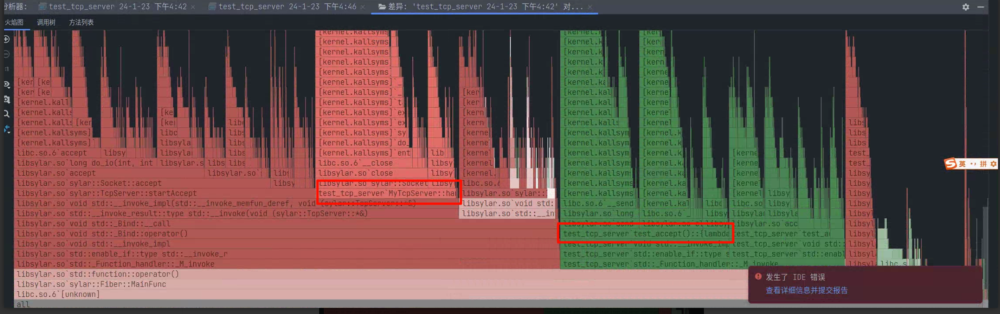

图中红框两块是接收连接的处理，

即对于客户端，读取，发送，关闭 这三连，可以发现时间占用其实是差不多的。

那我们看看区分主要在哪里：


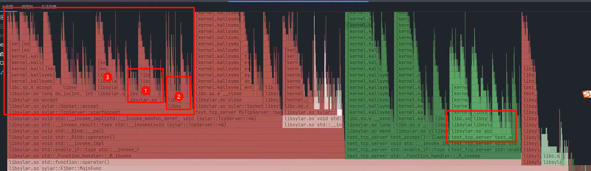

看下主要区分可能在图中红框处，尝试分析一下：

这两块是epoll发现新的连接过来并与之连接，我们可以看到这部分还是有一些差距的，分析分析：

①是fdManger，这部分两部分都有，两个对应的地方已经标注在下面图中红框，可以看到两部分的耗时其实差距不大，可能红色部分稍微多一点点。
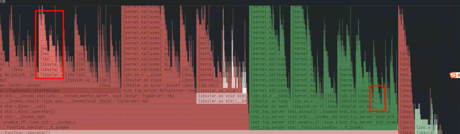
②是`Socket::init`，这部分占比还是挺大的。
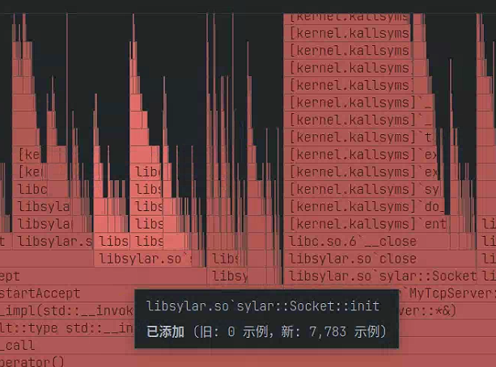
③是添加调度任务，个人认为可能是长连接超时的一些相关任务，虽然连接接受了之后会直接接受，然后也会占用一定的时间。
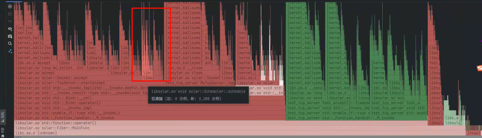
**总结：** 使用TcpServer相对于直接使用ioManager进行管理，其**额外的时间花费主要在于两个地方**：

1. `Socket::init`函数，这块可能是要负责对socket进行更多的管理，因此要初始化更多的东西。

2. 添加调度任务，因为对于一个真正tcpServer来说，除了维护和处理活跃的连接，还要负责处理超时等额外的任务，那么每一个新的连接到来之后这部分都要维护，所以这部分也需要一定的时间

> 这块没有查看具体的代码，只是理论上的分析。


分析用到的原始图片和clion-nova中perf分析导出的数据可见：[测试结果存放目录](./测试结果火焰图存放目录)

---

以下都非正文内容，可以忽略：

---


正好图打开了，再来看看有没有边角料：
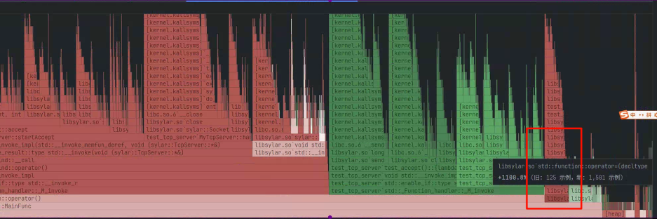

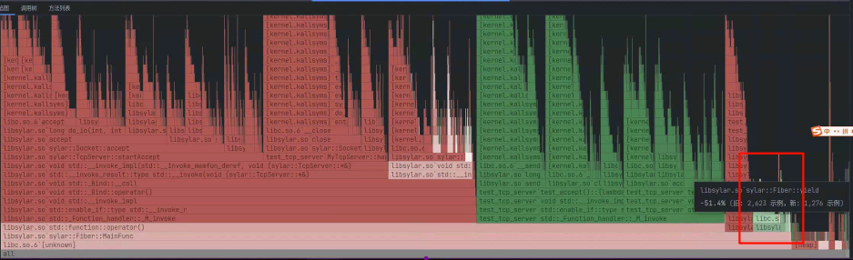

这部分占比不大，分别是`Fiber::yield`和智能指针的一些操作，两边应该都是有的。

---

可能的素材：

tcpServer

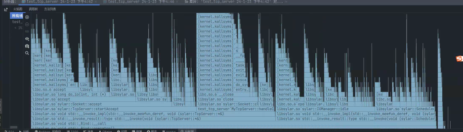

手写：

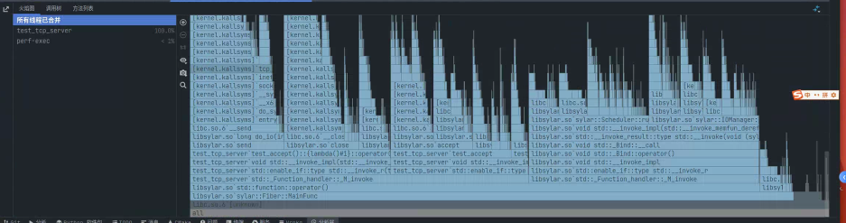

对比分析按钮

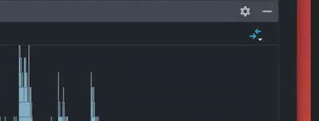

四种显示方式

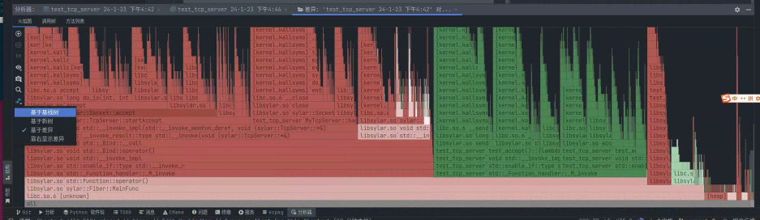